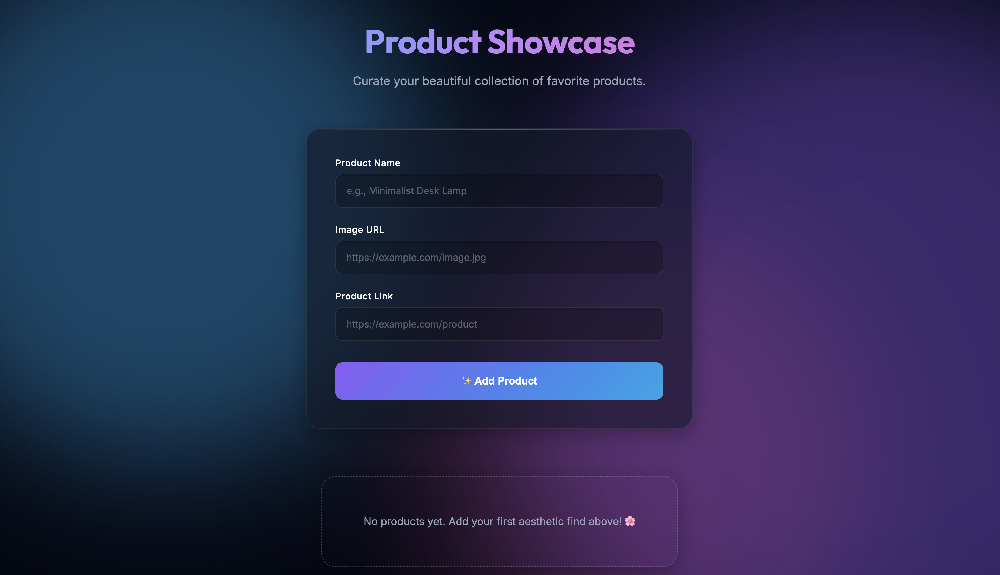

# ✨ Aesthetic Product Showcase Builder

A visually stunning product showcase web app built using HTML, CSS, and JavaScript.

## 🌸 Features

* Add products with image and link
* Beautiful glassmorphism UI
* Responsive grid layout
* Delete products
* Copy caption for social media
* Data saved using localStorage

## 🚀 Tech Stack

* HTML
* CSS (Glassmorphism + Animations)
* JavaScript (DOM + localStorage)

## 💡 Use Case

Perfect for content creators to organize and showcase aesthetic products and generate captions for social media.

## 📸 Preview

## 🧠 What I Learned

* DOM manipulation
* LocalStorage usage
* UI/UX design principles
* Building a real-world mini project

---

Day 1–5 GitHub consistency project 🚀
